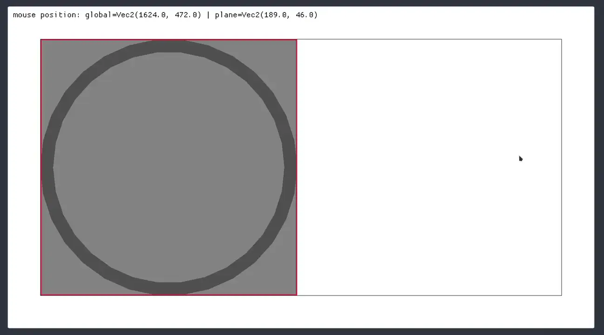

# macroquad-viewplane-camera

Dynamic and easy rendering of a 2D plane using Macroquad's camera system.
This crate removes the hassle of setting up a robust 2D camera system in Macroquad and lets you focus on building your actual project.
Draw calls can be performed in a local coordinate space (e.g. a game level) and projected onto the window, handling panning, zooming, window resizing and viewport constraints.
The view can be constrained to a dynamically resizable viewport inside the window, making it easy to integrate with UI elements such as a sidebar.
This crate is ideal for building simulations or editor-style applications.



## Installation

_TODO_

## Quick Start

Here is a minimal example on how to use this crate. For more details check out `examples/advanced.rs` and `examples/egui.rs`.

```rust
#[macroquad::main("minimal")]
async fn main() {
    // create camera with plane dimensions [100, 100]
    let mut vp_cam = ViewplaneCamera::new(100.0, 100.0);

    loop {
        clear_background(WHITE);

        // set viewport with 200px sidebar
        let x_sidebar = screen_width() - 200.;
        vp_cam.set_viewport(0, 0, x_sidebar as i32, screen_height() as i32);

        // handle scroll wheel zoom + mouse drag panning
        vp_cam.handle_inputs();

        // apply camera (sets macroquad camera internally)
        vp_cam.apply();

        // draw in local plane coordinates, put all your draw calls here
        vp_cam.draw_debug(); 

        // restore default camera for rendering in global screen space (e.g. UI)
        vp_cam.reset_camera();

        // draw sidebar/viewport boundary in global space
        draw_line(x_sidebar, 0.0, x_sidebar, screen_height(), 2.0, BLACK);

        next_frame().await;
    }
}
```

## Configuration

The viewplane camera uses a builder pattern for configuration:

```rust
let mut vp_cam = ViewplaneCamera::new(100.0, 100.0)
    // zoom
    .with_zoom_factor(0.85)              // zoom speed (default: 0.9)

    // mouse panning
    .with_mouse_pan(MouseButton::Middle) // change pan button (default: Left)

    // keyboard panning (disabled by default)
    .with_wasd_pan(0.05)                 // enable WASD panning with step size
    .with_arrow_key_pan(0.05)            // enable arrow key panning with step size

    // reset pan/zoom to default
    .with_reset_key(KeyCode::Q);         // press Q to reset pan/zoom (default: R)
```

Disable mouse panning / zooming:

```rust
let mut vp_cam = ViewplaneCamera::new(100.0, 100.0)
    .without_mouse_pan()
    .without_zoom();
```

## Manual Input Handling

The built-in input system can be (temporarily) disabled by simply not calling `handle_inputs()`.
Also, you can use the low-level methods instead for full control:

```rust
// zoom in/out by configured factor
vp_cam.zoom(true);   // zoom in
vp_cam.zoom(false);  // zoom out

// pan by local shift (in normalized screen coordinates)
vp_cam.shift(Vec2::new(dx, dy));

// reset pan and zoom to initial state
vp_cam.reset();
```

## Utilities

```rust
// check if mouse is currently inside plane bounds:
if vp_cam.mouse_in_plane_view() {
    // ...
}

// get mouse position in local plane coordinates:
let plane_pos = vp_cam.mouse_plane_pos();

// access to the underlying `Camera2D`:
let mq_cam: &Camera2D = vp_cam.get_camera();

// update plane dimensions 
vp_cam.set_plane(plane_width, plane_height);
```

## `egui` integration

The viewport can be resized dynamically respecting `egui` UI elements.

```rust
// after egui layout
let rect = egui_ctx.available_rect();
vp_cam.set_viewport(
    rect.min.x as i32,
    rect.min.y as i32,
    (rect.max.x - rect.min.x) as i32,
    (rect.max.y - rect.min.y) as i32,
);

// only handle inputs if egui does not use it (e.g. moving egui window)
if !egui_ctx.wants_pointer_input() {
    vp_cam.handle_inputs();
}
```
